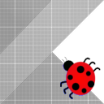

# Kotlin Debug Adapter
A [debug adapter](https://microsoft.github.io/debug-adapter-protocol/) that provides IDE-independent debugging support for Kotlin/JVM.

Any editor conforming to DAP is supported, including [VSCode](https://code.visualstudio.com) for which a client extension is provided by this repository.

## Getting Started
* See [BUILDING.md](BUILDING.md) for build instructions
* See [Editor Integration](editors/README.md) for editor-specific instructions
* See [Kotlin Quick Start](https://github.com/fwcd/kotlin-quick-start) for a sample project
* See [Kotlin Language Server](https://github.com/fwcd/kotlin-language-server) for smart code completion, diagnostics and more

## Usage

### with VSCode
* Setup:
    * Open the `launch.json` file in your project and invoke code completion to create a new launch configuration (or select `Add Configuration...` in the debug tab)
* Launch:
    * `./gradlew build` your project (before every launch)
	* Click the `Run` button in the `Debug` tab or press `F5`

## Architecture
`DAP client` <= JSON => `KotlinDebugAdapter` <=> `Core abstractions` <=> `Java Debug Interface`
